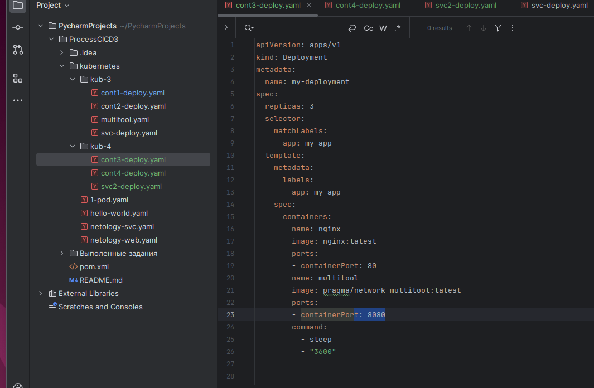
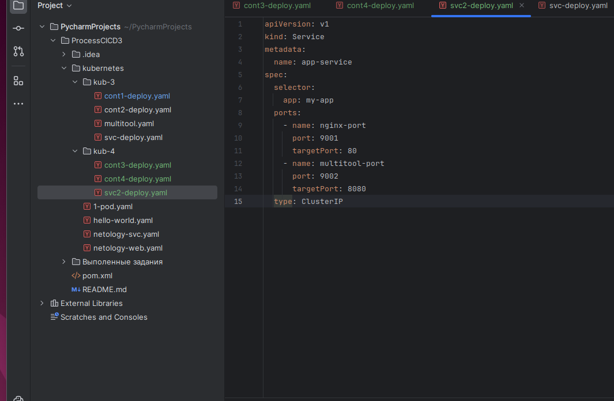
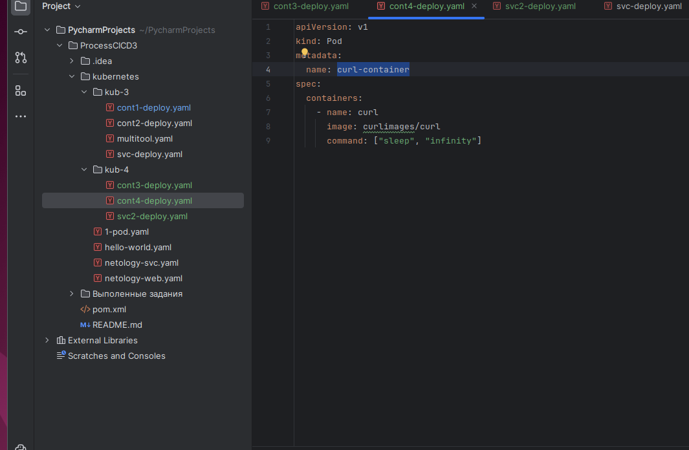
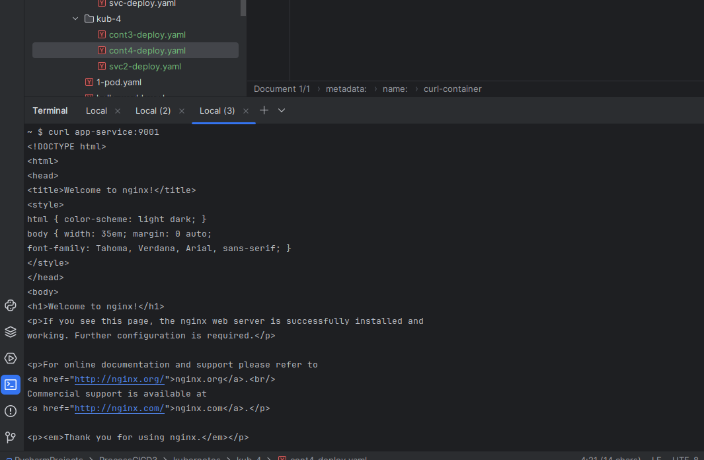
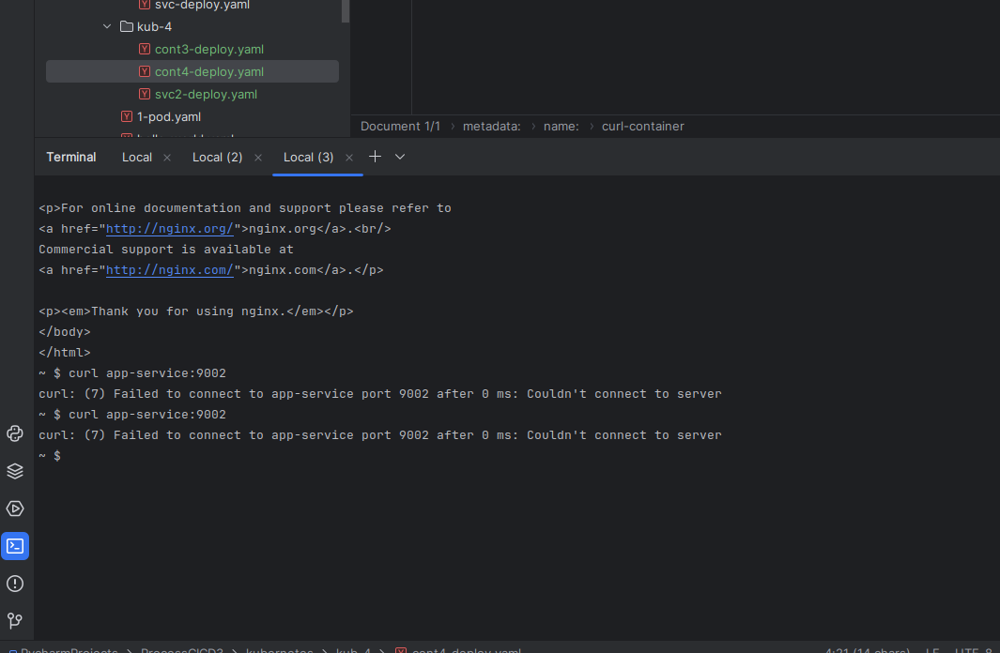
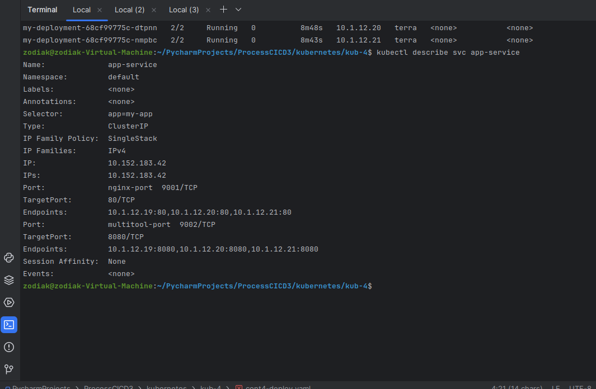
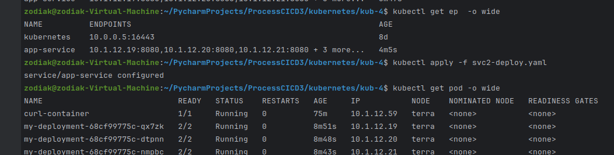
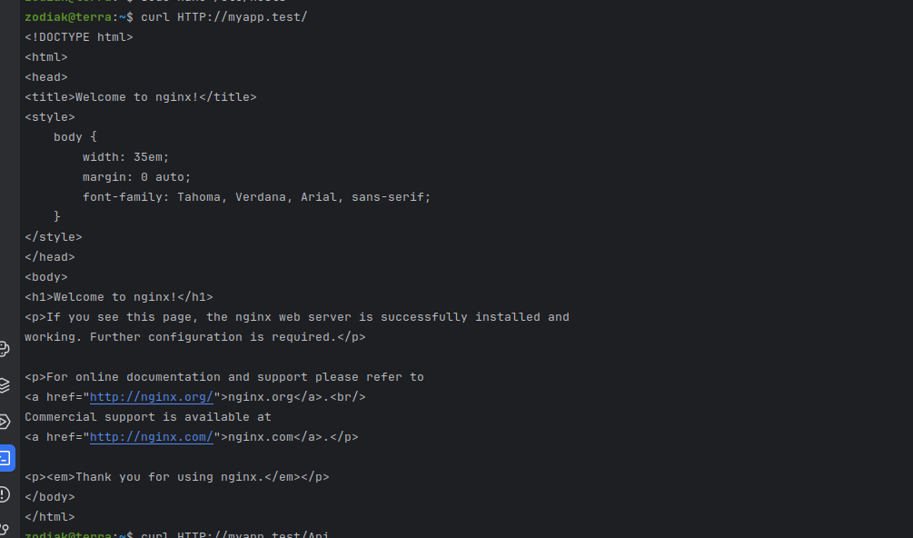
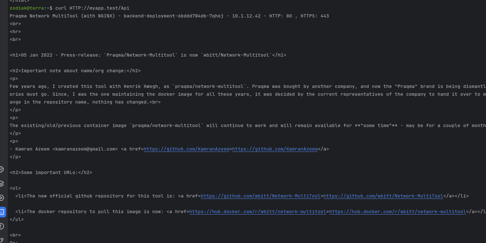

  Создаю Deploy для двух контейнеров
  
  
  
  Создаю svc
  
  
  
  Отдельный pod на тест
	

И не могу понять в чем ошибка по 9001 порту все хорошо 

Но 9002 не работает 

  Проверяю все же верно вроде. Нужна помощь.
  

Проблема оказалась смешной, когда прописывал имя днс на хосте,вместо точки поставил запятую. Исправил. Курлы курлы успешно на оба сервиса.

  

