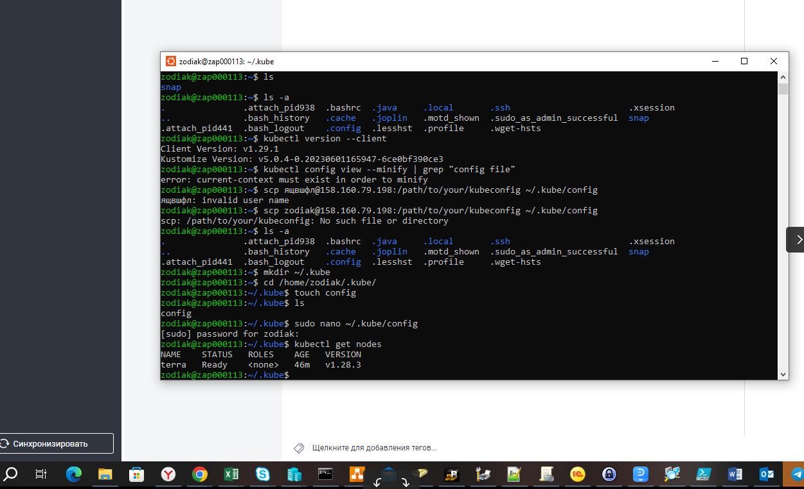
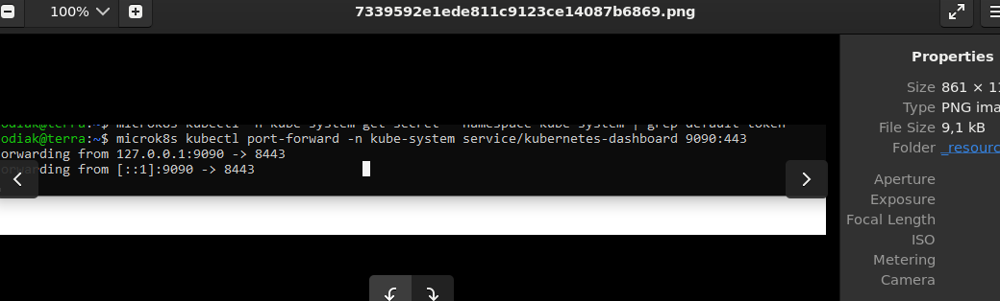
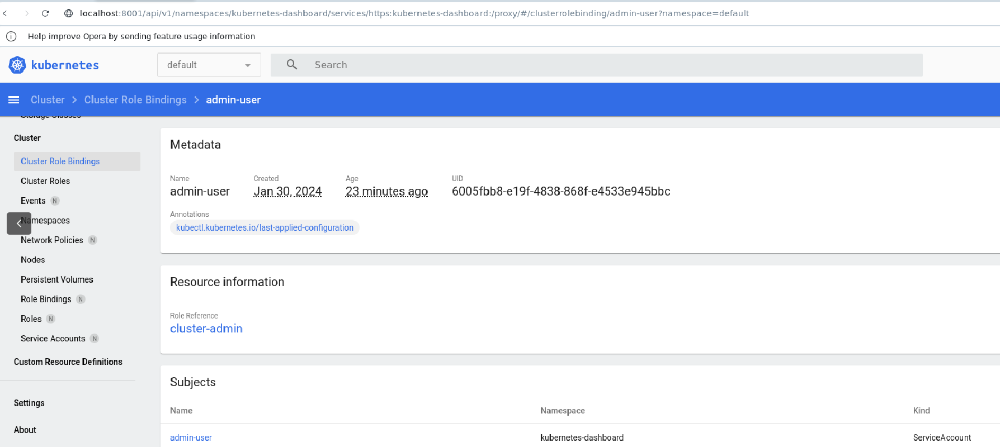

## Задача 1
Пришлось повозиться немного. Поднял WSL c Ubintu 
Установил kubectl 
В яндекс облаке развернул машину, поставил k8s настроил сертификат на внешний ип.
На локальной отредактировал файл, странно при установке он не создался пришлось ручками. Прописал адрес, скопировал сертификат.
Проверяю локально 

Ставлю dashboard

Дашборд

