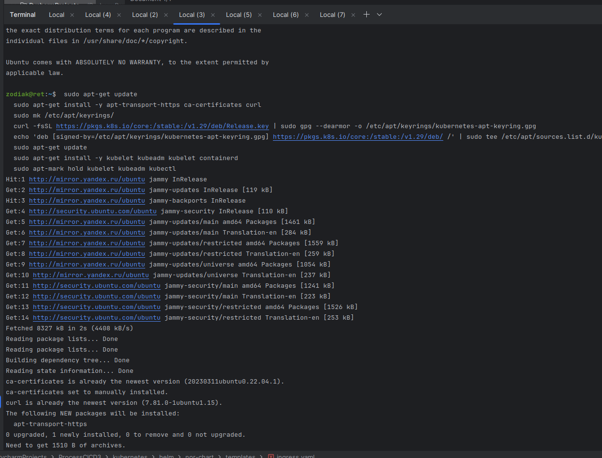
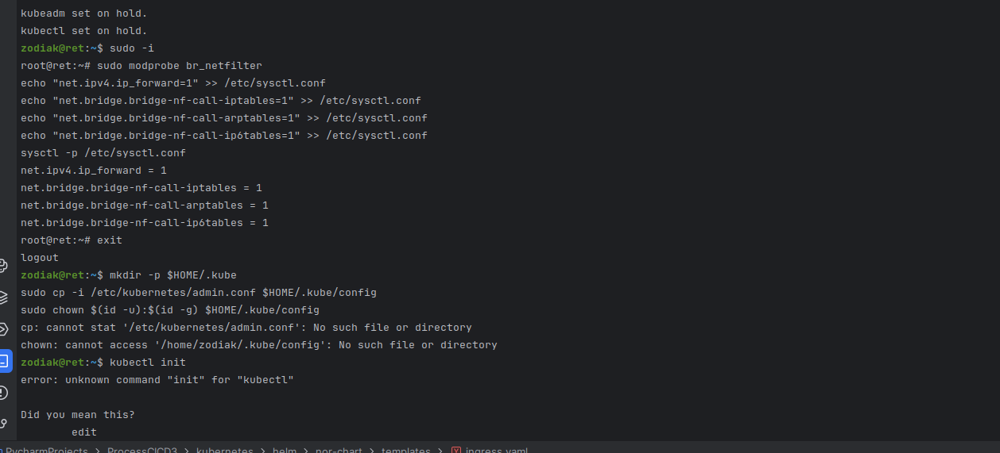
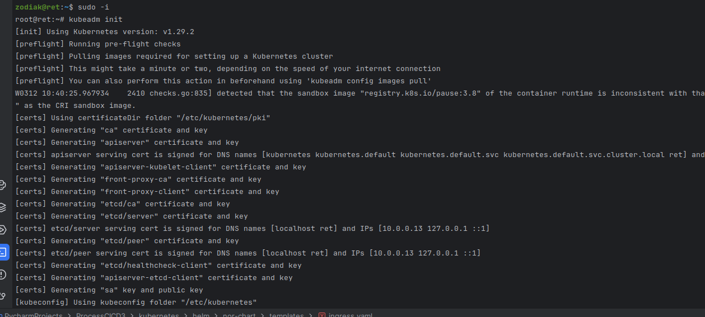
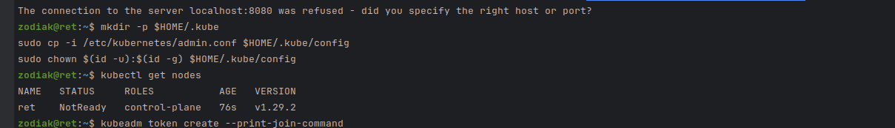
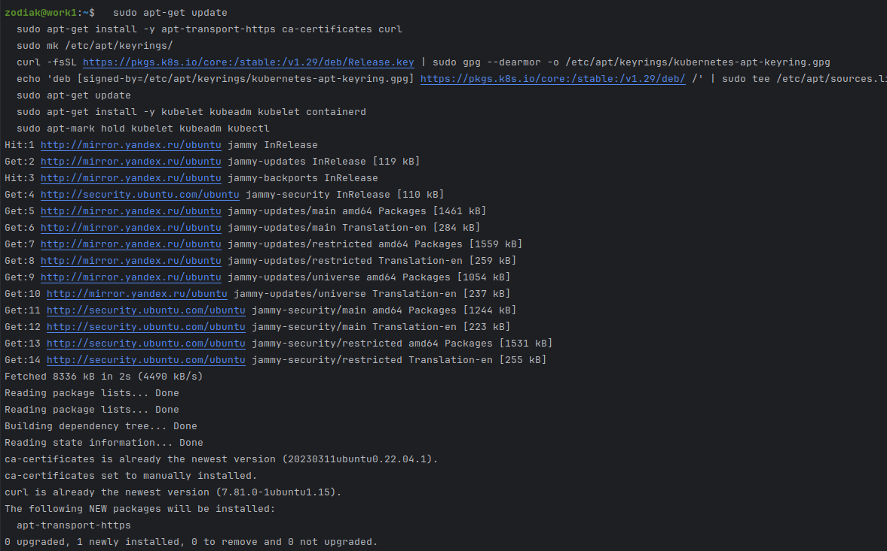
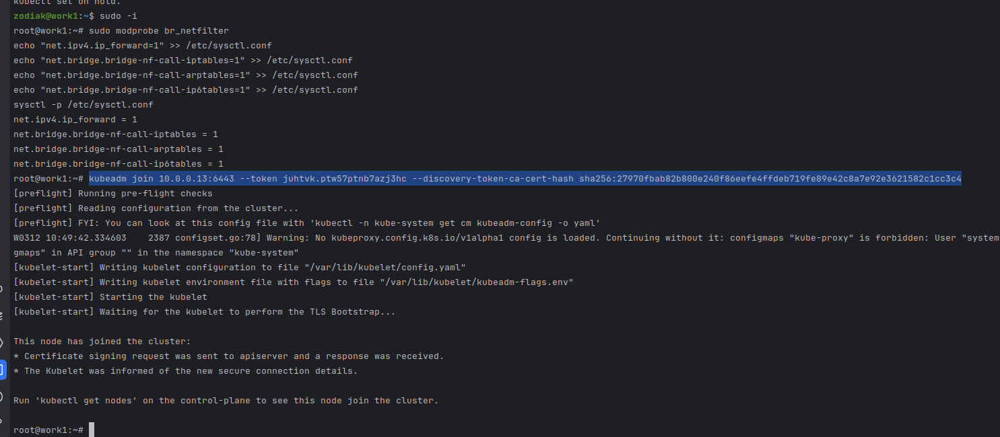
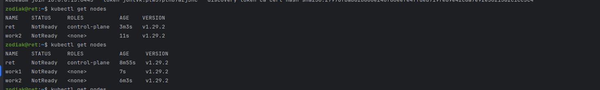
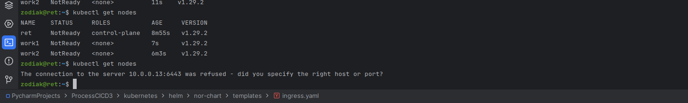

Посмотрел лекцию почитал мануал. Начал исполнять.
Поставилд несколько машин в яндекс облаке.
На мастере ставлю кубик, через kubeadm взял версию по новее

Затем форвардинг

Инициализирую под рутом, без правил т к цель задания просто развернуть.
Внешний ip прописывал.Оставил все по умолчанию.

Импорт конфига, проверка.

Первая рабочая нода

Подключаю к кластеру.Аналогично со второй и длаее.

Итог

Выявил какую то аномалию.
Мастер отключается через какое то время, пока настраиваю 3 ноду она падает.
ПОчитал посмотрел видео ни где не могу найти инфу что делаю не так. Просьба обьяснить.

Т е запускаешь и вывод следующий.  Но суть ясна, скорее всего это что то от яндекса.

