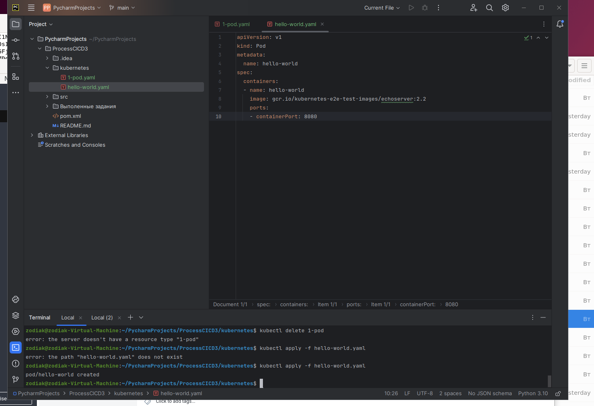
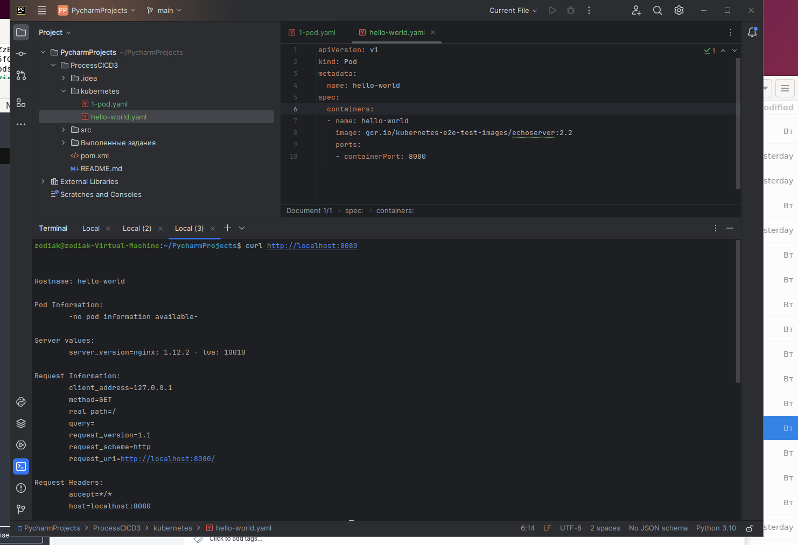
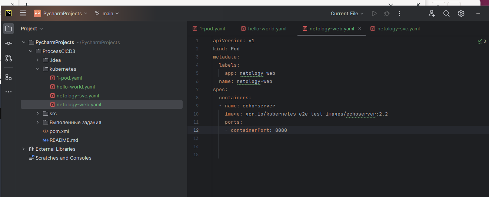
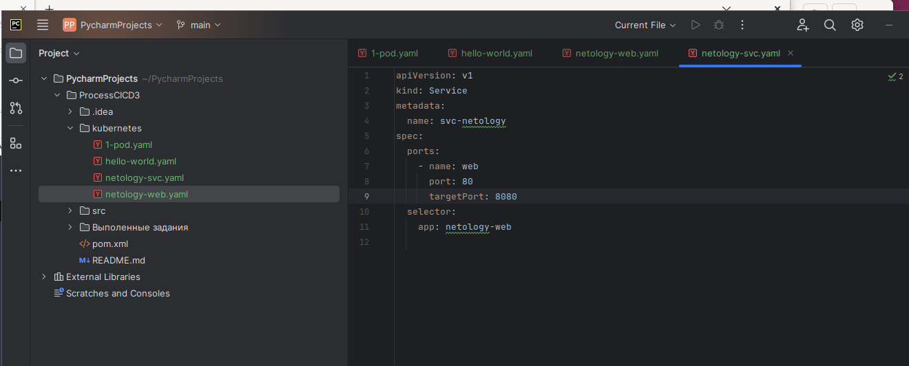
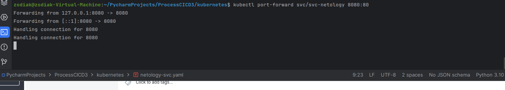
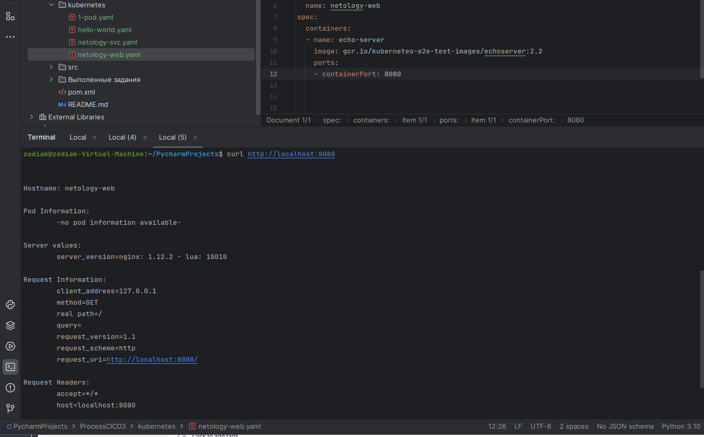
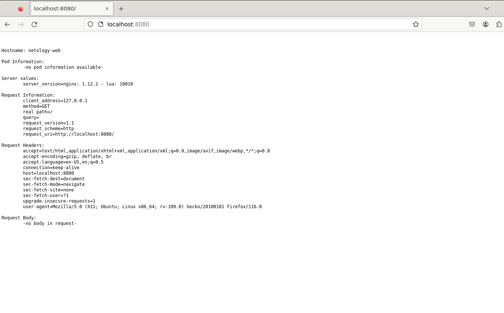

## Задание 1. Создать Pod с именем hello-world

Создаю манифест, и pod.

подключаюсь локально

И curl

## Задание 2. Создать Service и подключить его к Pod

Создаю pod - netology-web and netology-svc

проброс

curl

web

