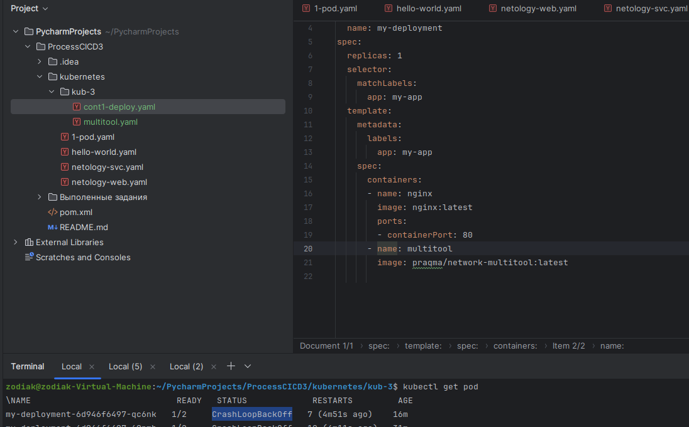
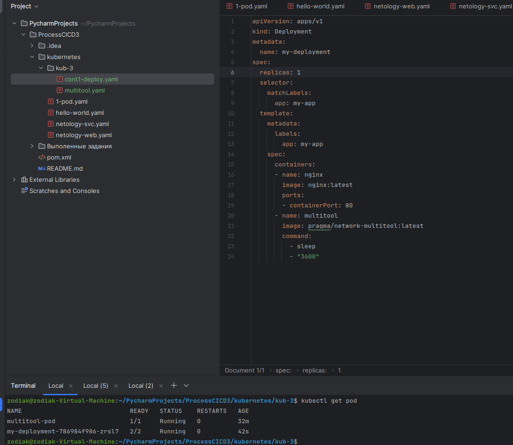
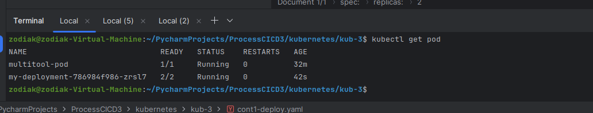
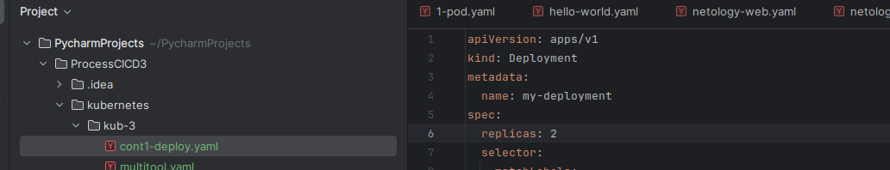
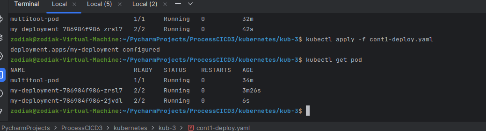
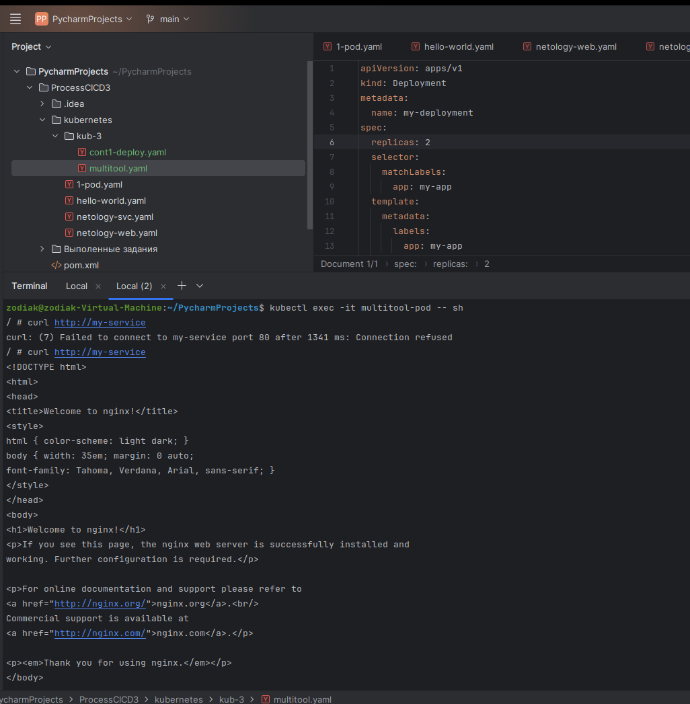
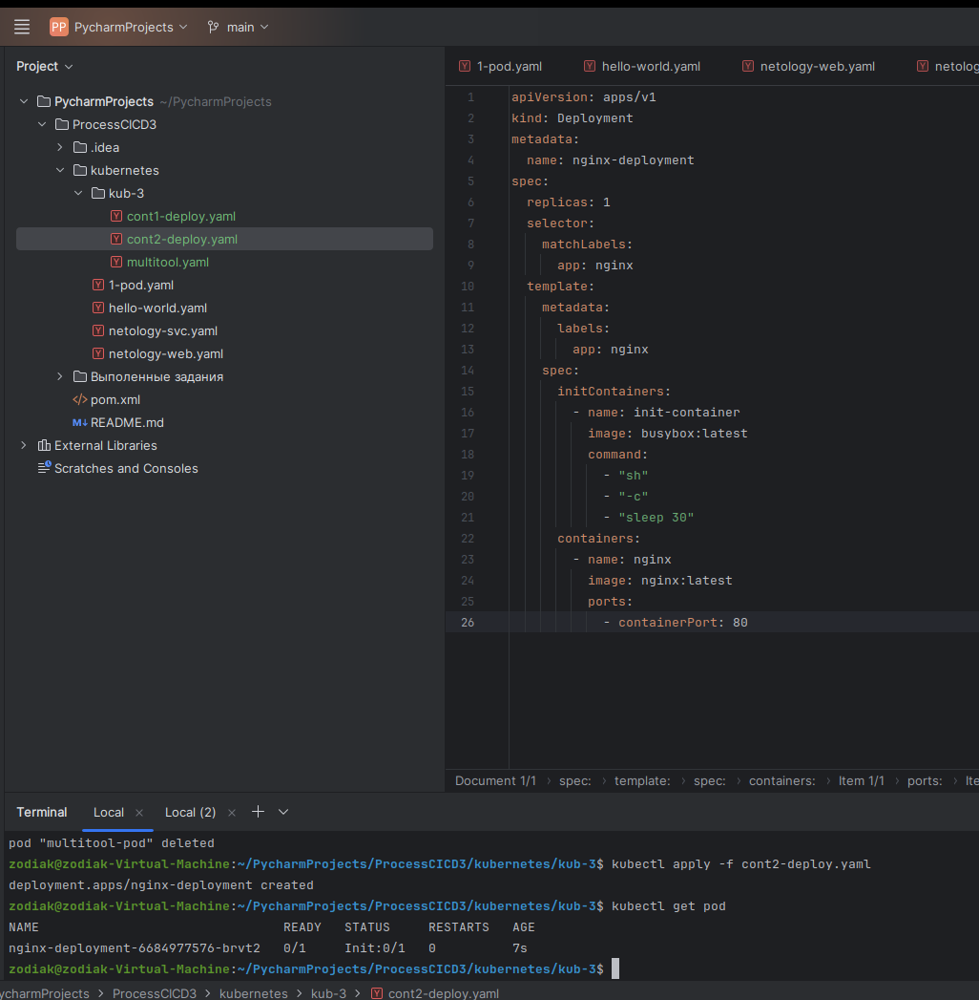
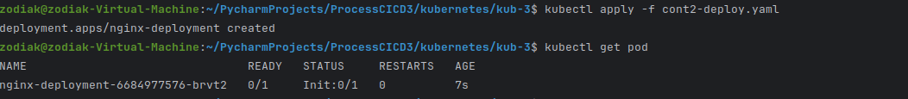
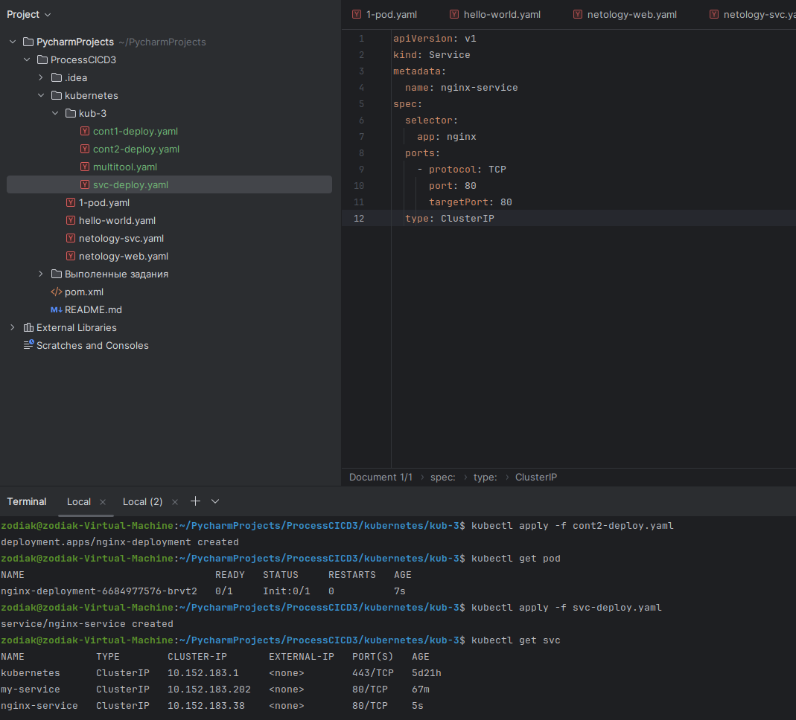
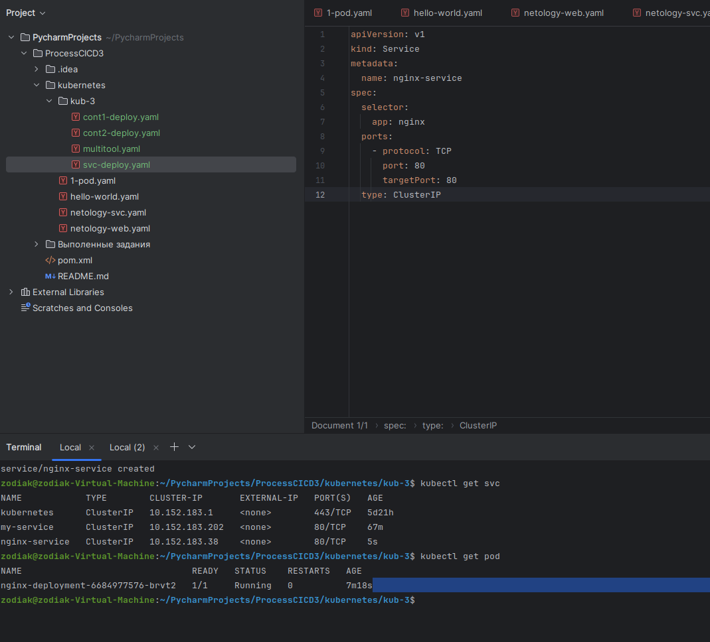

## Задача 1

Создаю Deployment. Запускаю. Получаю.CrashLoopBackOff

Пересоздаю c с поправками

Количество реплик в манифесте -1.
Количество pod -1

Меняю в манифесте на 2. Запускаю, проверяю pod-2.

Создаю отдельный Pod. Курлык курлык. Успешно.

## Задание 2
Создаю Deployment приложения nginx с условиями

Не стартует

Svc

Проверяю поды после сервиса. 

