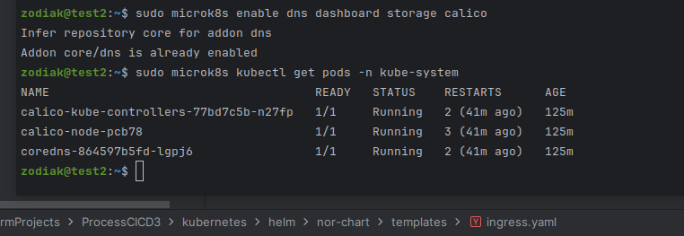
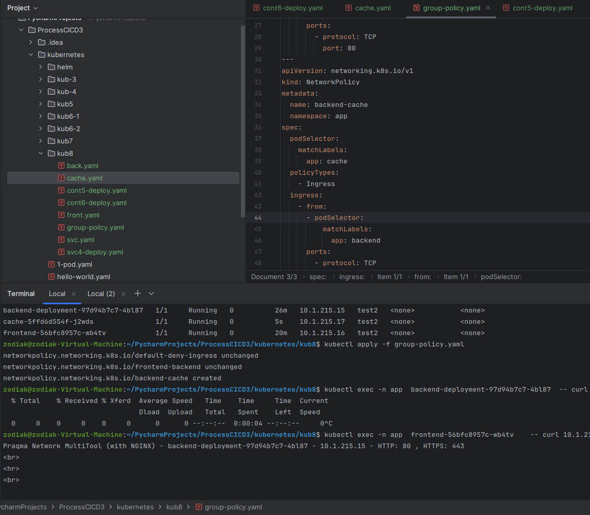
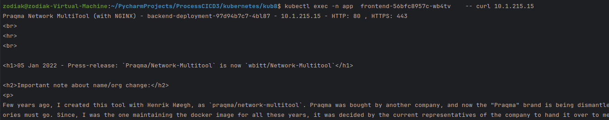
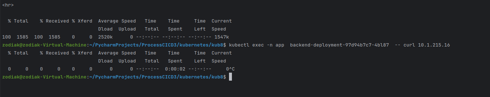

Случайно убил тестовую машину пришлось развернуть все заново.
Поставил calico проверяю.

ok
Пишу манифесты, запускаю, проверяю.

Бью с frontend в backend

Ок. Показываю что назад трафик не идет.

