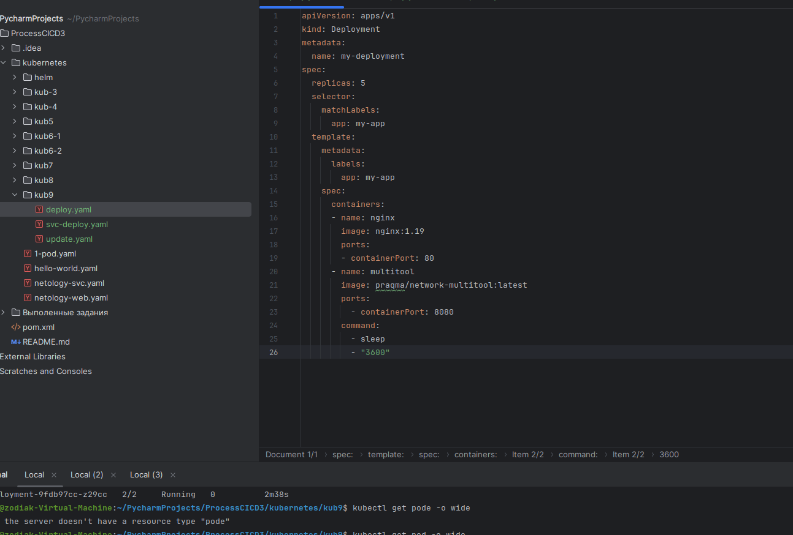
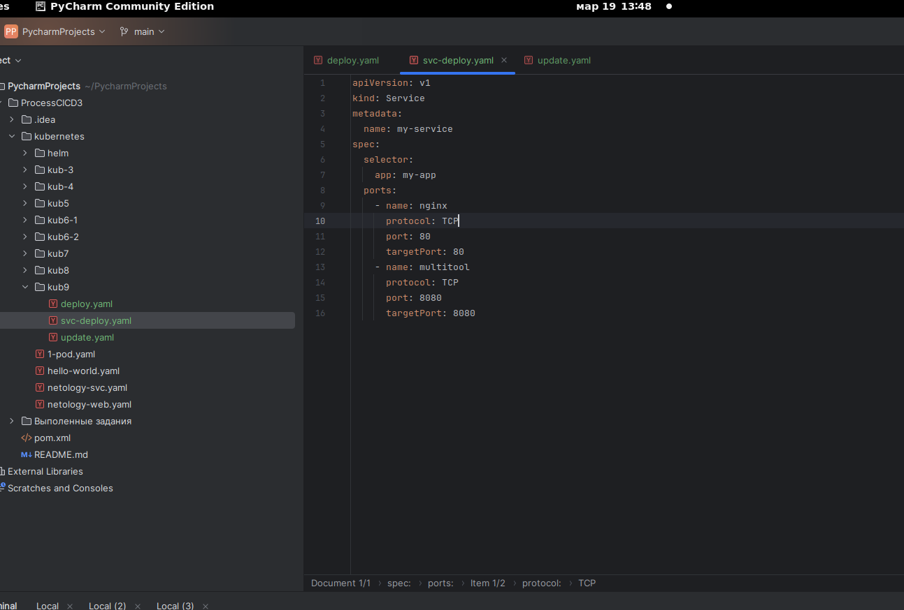
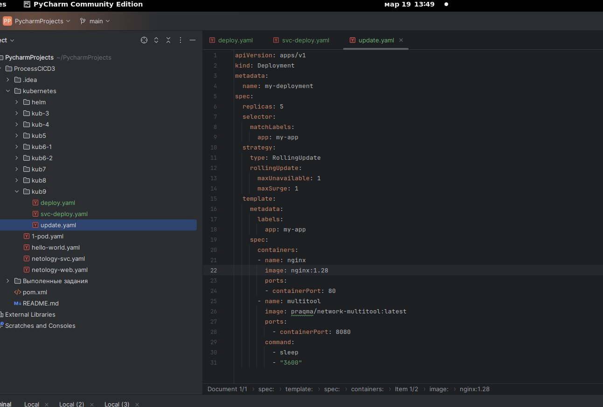
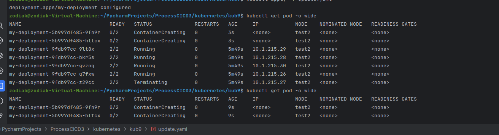
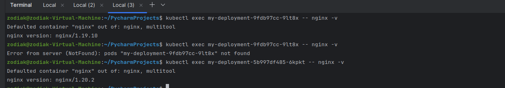
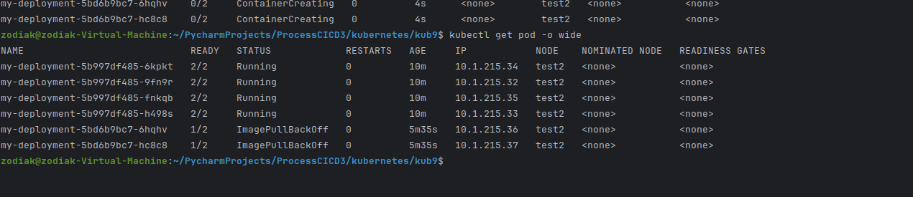
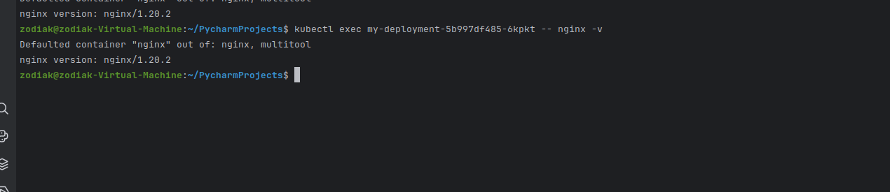
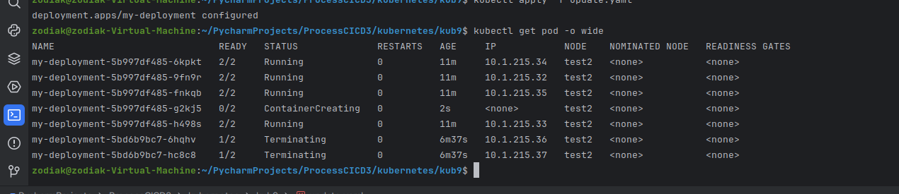
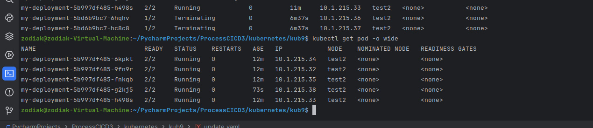

## Задание 1

 Исходя из того , что версия мажорная, и старая версия не совместима с новой, + ограниченные ресурсы без возможности увеличения. Я бы использовал rolling update с load management. Данная стратегия позволяет обновлять реплики по очереди, заменяя старые на новые, это уменьшает риск простоя всего приложения. Управление нагрузкой позволит распределить трафик между старыми и новыми версиями, обеспечит плавный переход.
      Учитывая 20% резерв можно использовать его для запуска новых версий прилоджения на части ресурсов, проверяя при этом их производительность и работоспособность. 
Такой подход поможет снизить риск остановки приложения из-за несовместимости новых версий, а также минимизировать негативное влияние на пользователей путем постепенного и контролируемого обновления.

## Задание 2.

Выключал машину в яндекс, сменил адрес пришлось переделывать сертификат.
Создаю podы и svc

Манифест для update учитывая условия задачи.

Обновление 1.20

Проверка версии 

Обновление 1.28 

Приложение доступно но не обновлено.

Откат проверка.

