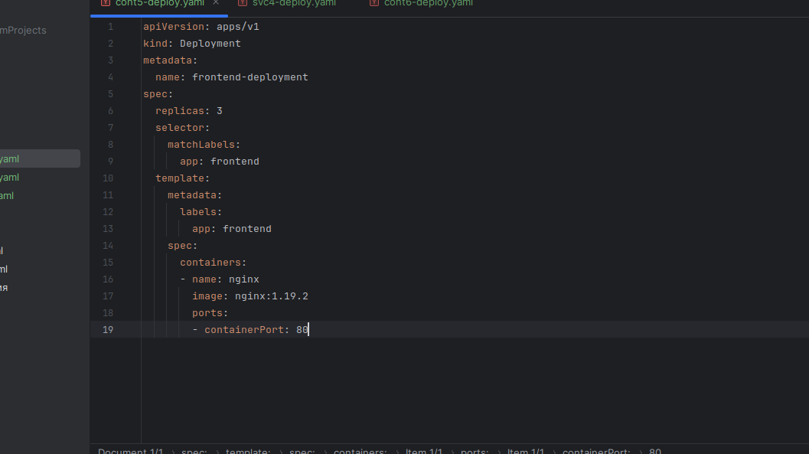
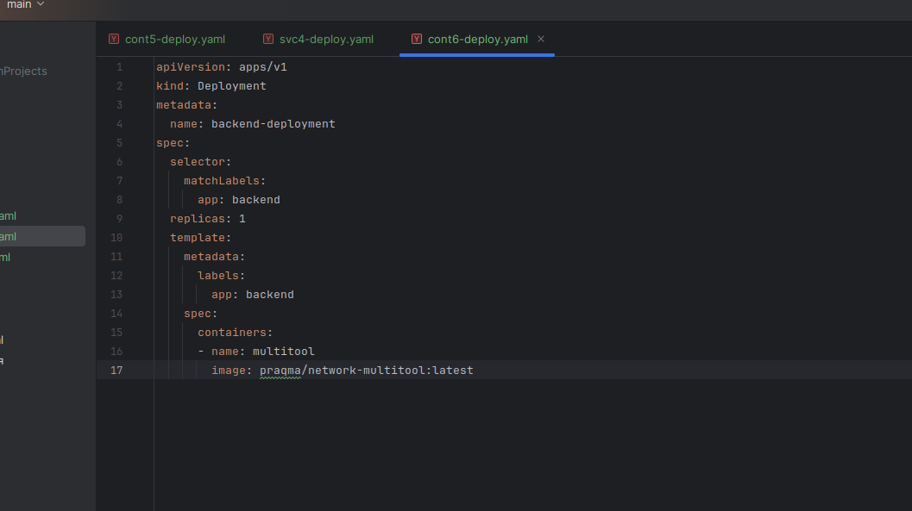
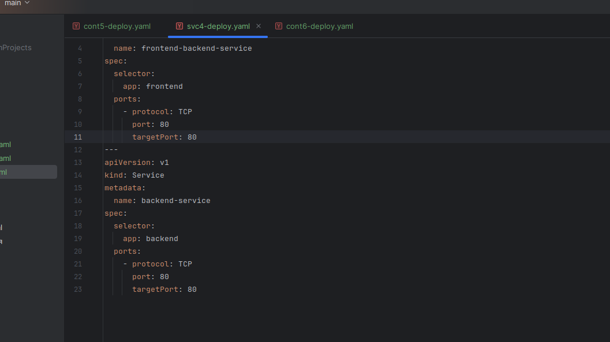
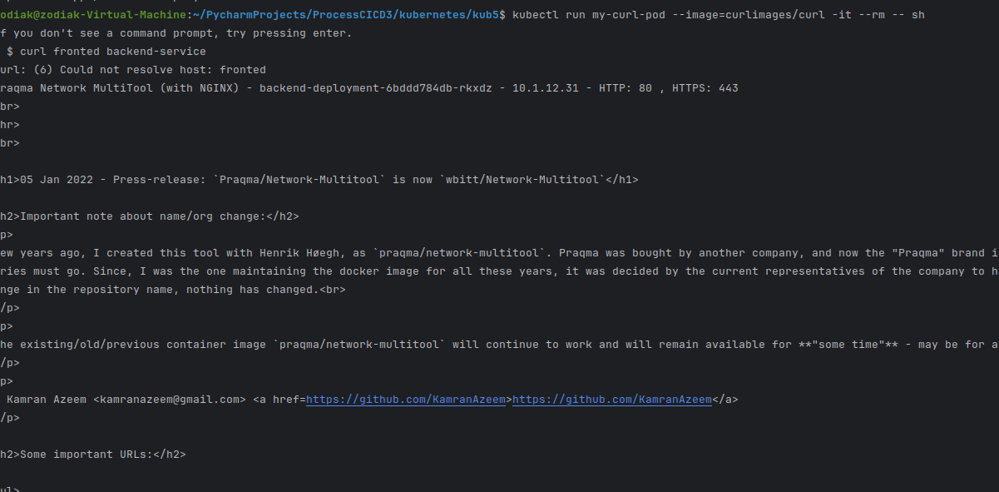
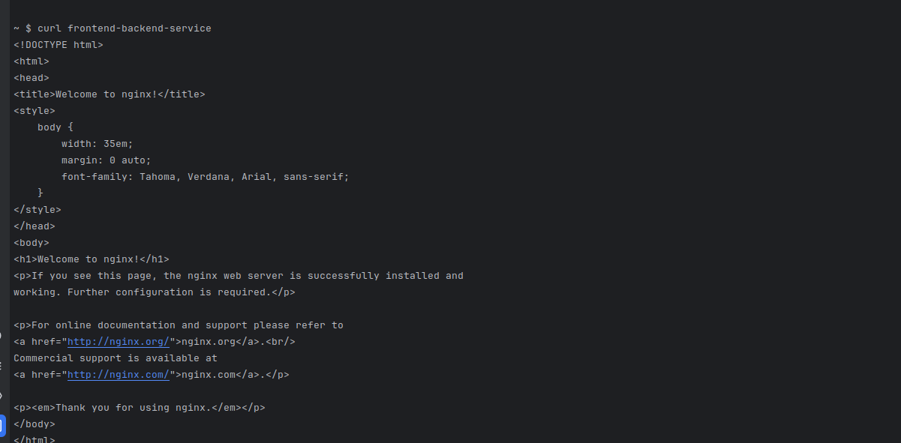
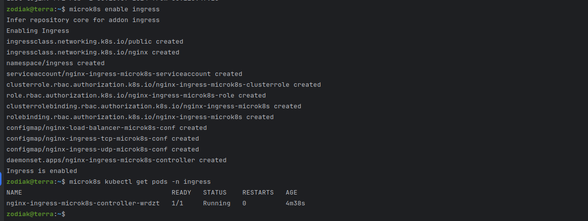
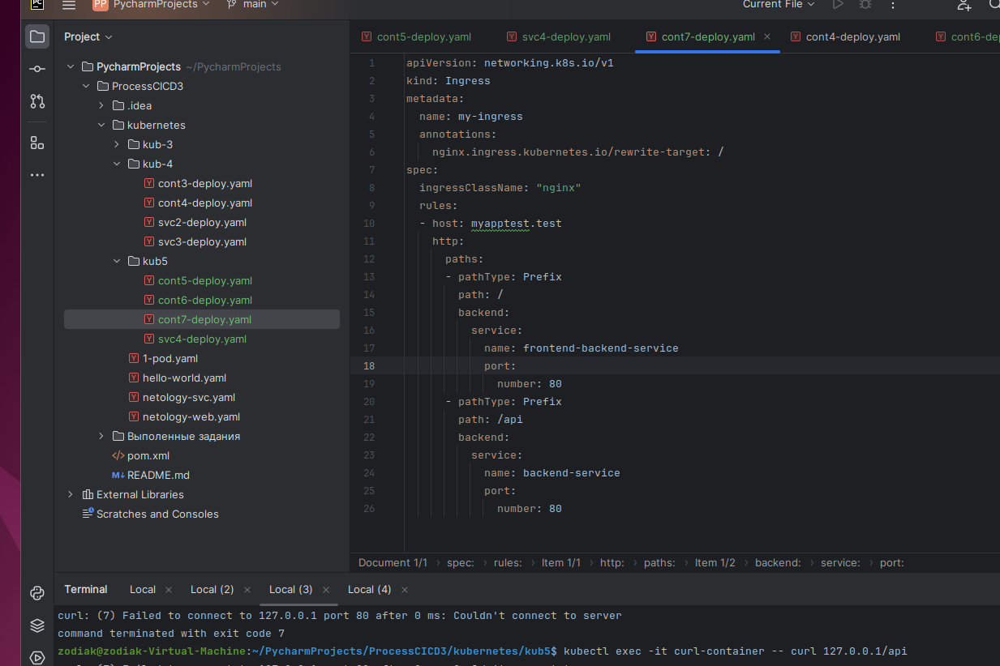
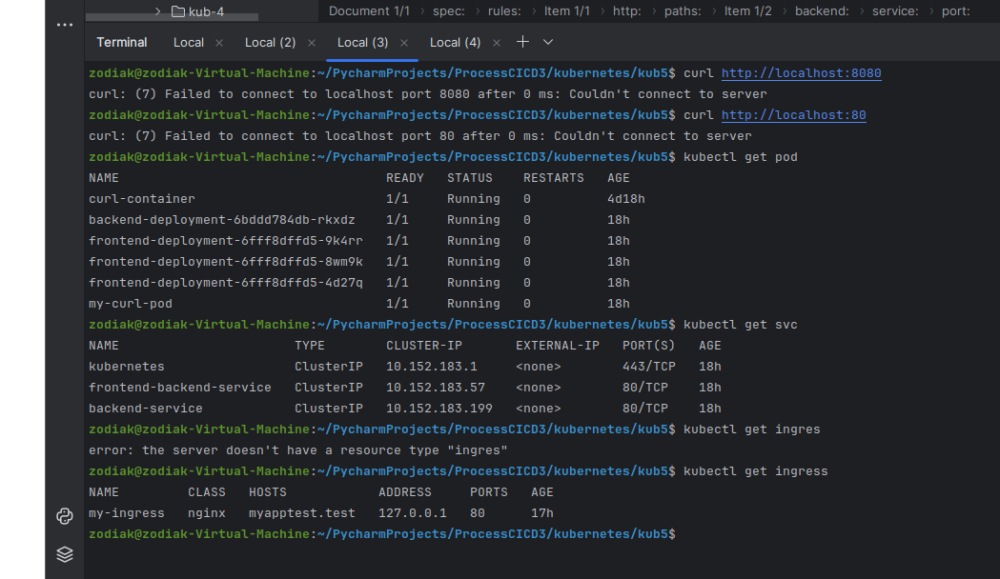
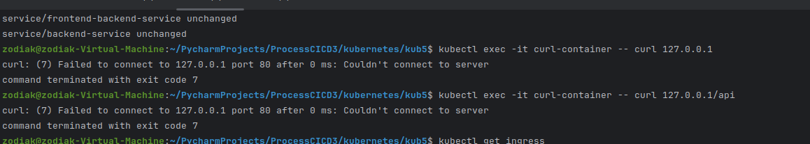

## Задание 1. Создать Deployment приложений backend и frontend

1 Создаю манифест frontend из образа nginx с количеством реплик 3 шт

2 Создаю манифест Deployment приложения backend из образа multitool.

Добавляю svc

Курлы курлы

## Задание 2. Создать Ingress и обеспечить доступ к приложениям снаружи кластера

1 Включаю Ingress-controller в MicroK8S
Проверяю

Создаю манифест

Проверяю.

Все отработало исправно. Но curl не проходит. Не понимаю где ошибка.Днс прописал, контейнеры работают, ингрес тоже.

