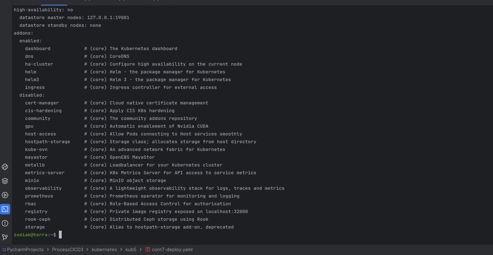
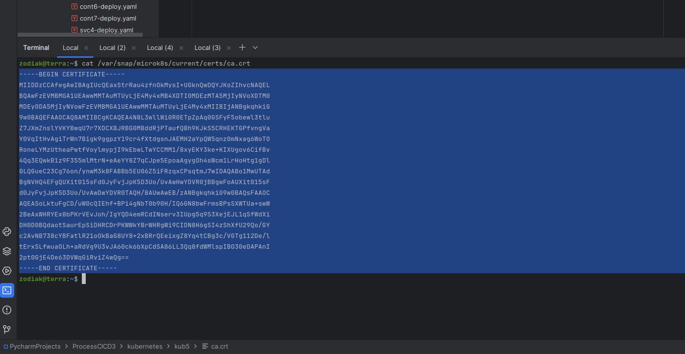
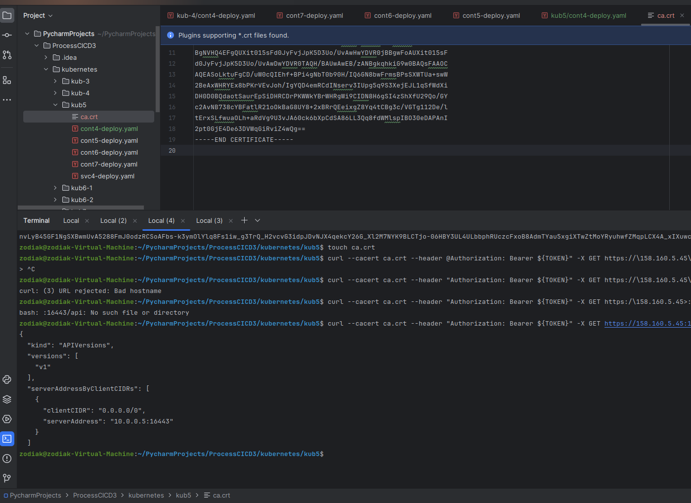
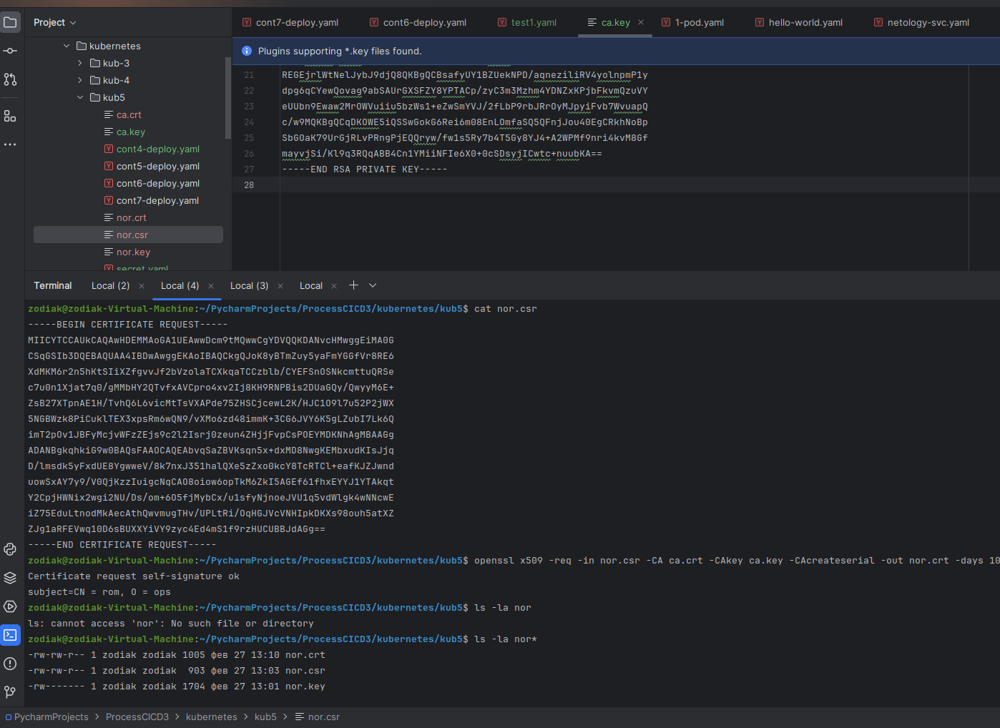
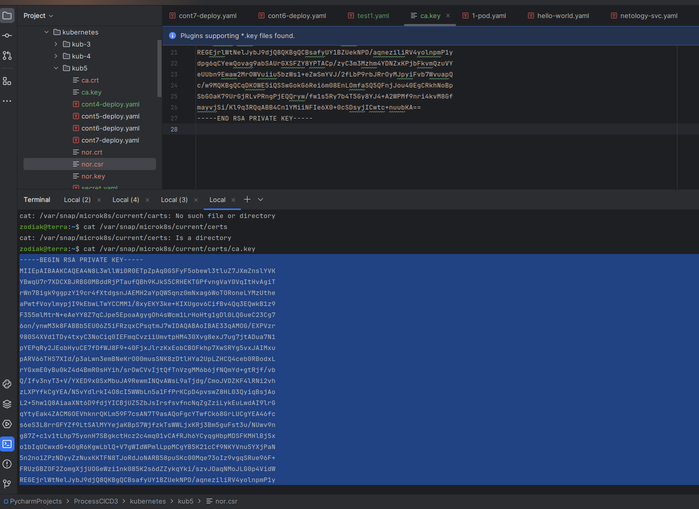
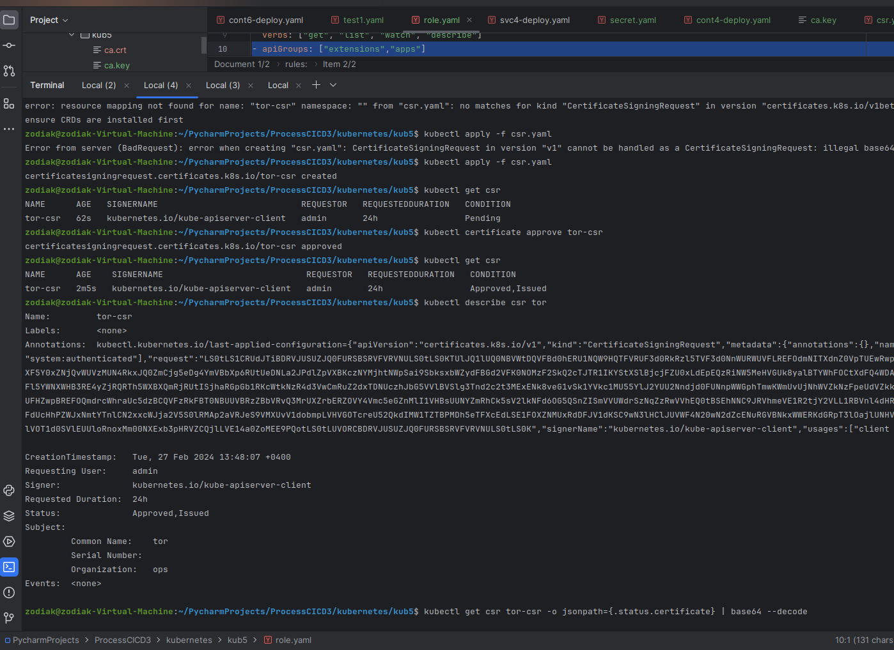
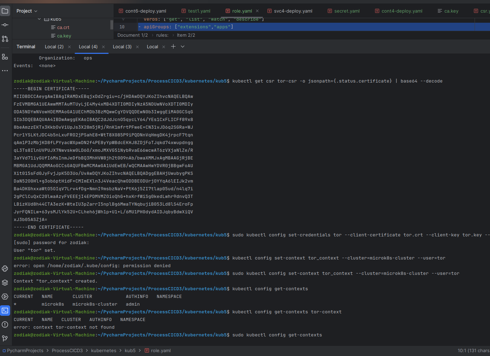
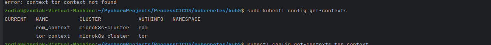
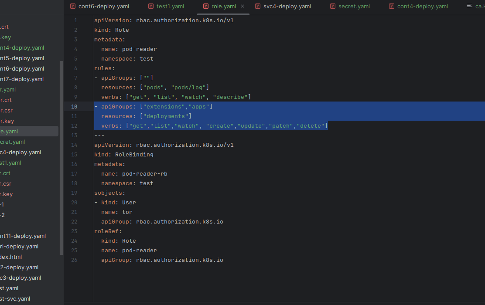
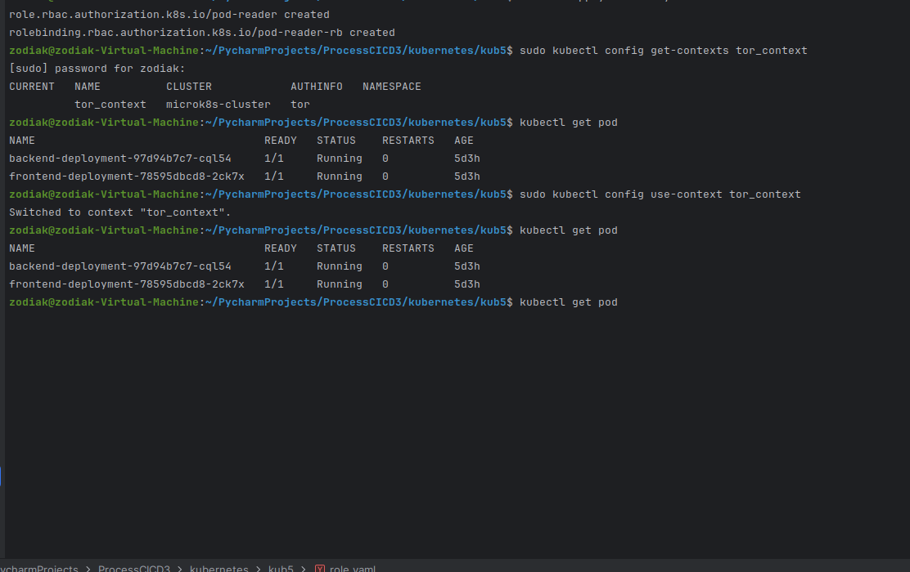

Проверяю rbac включен или нет.

Решил протестить как на лекции с временным токеном. Беру с яндекса.

Создаю у себя.Проверяю.ok

Выпускаю сертификат, подписываю. \ Свечу ключами, но машина тестовая.

Тестировал в разных вариантах. С двумя пользователями. 
rom и tor/
Создавал сертификат, подписывал. Все как по лекции. В конечном итоге дал роли пользователю tor/
И в конце проверка на нем. Единственное права, через sudo делал.

