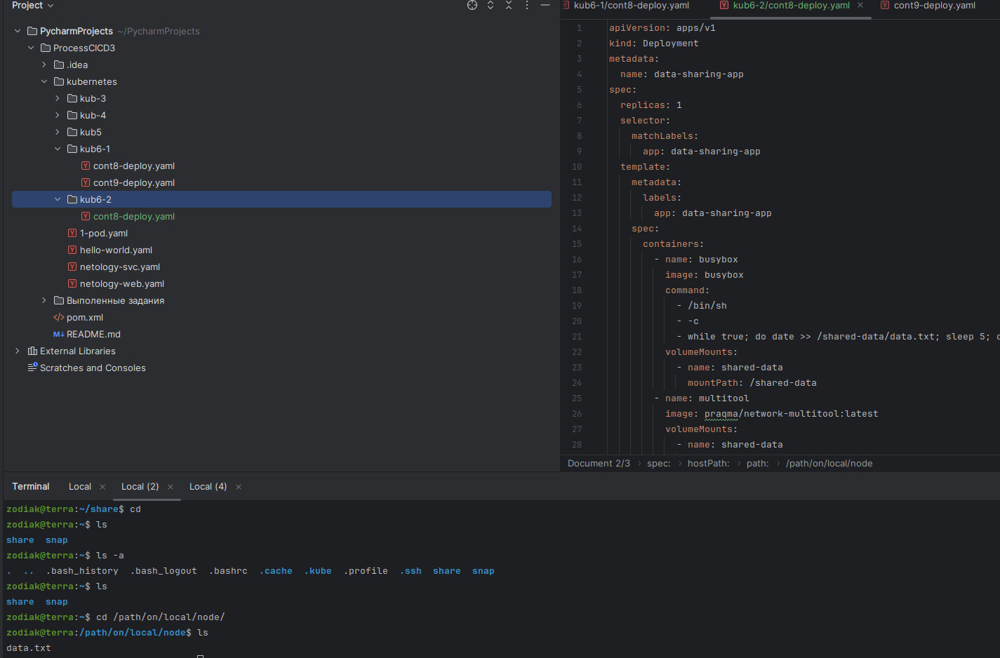
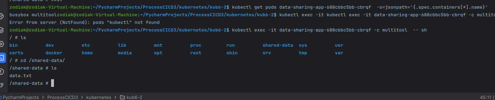
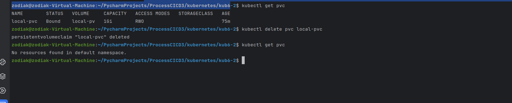
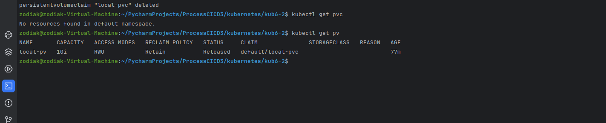
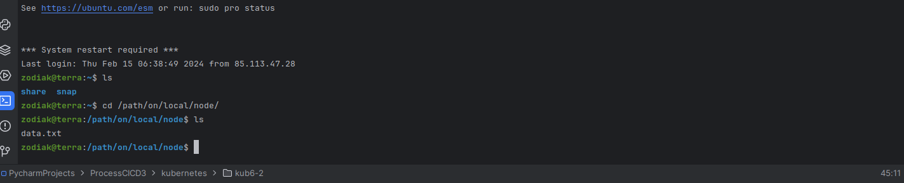
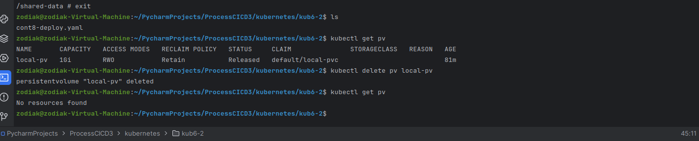
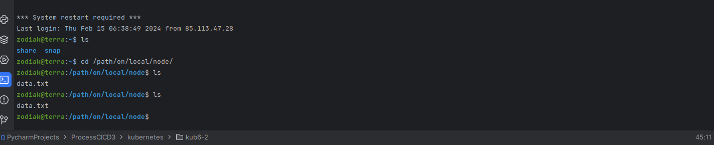
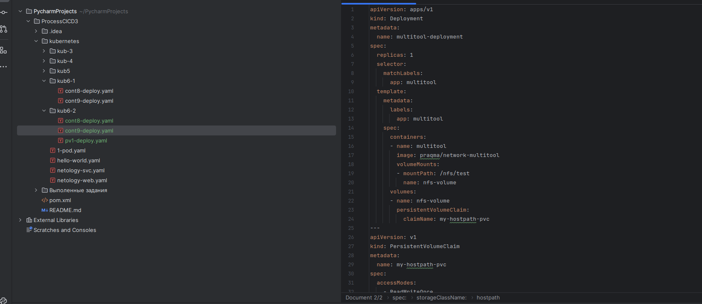
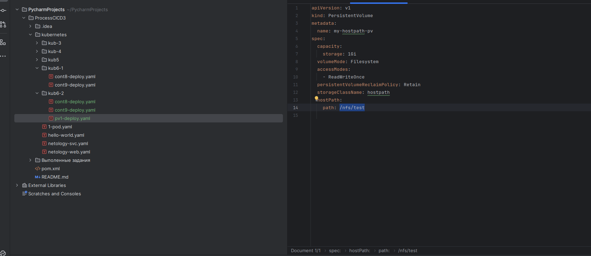
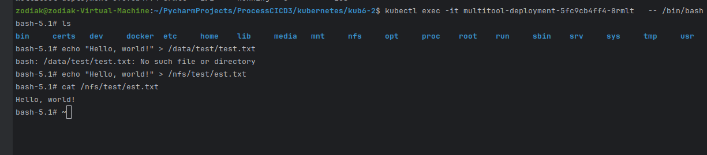

## Задание 1

Создаю деплой для подов и pv/pvc

Шара из multitool

Удаляю PVC

PV останется, но он не используется.

Захожу на ноду смотрю файл.

Удаляю PV

Проверяю,файл остался на диске ноды, PV представляет доступ до файла но не управляет им.

## Задание 2

Включил NFS создаю деплой.

PV

Проверяю. Захожу на под, создаю файл, читаю.

