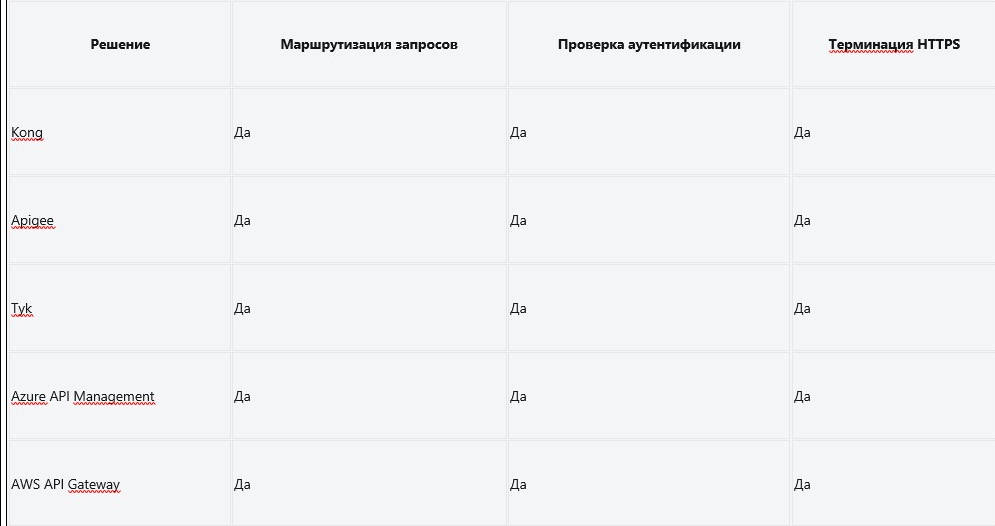
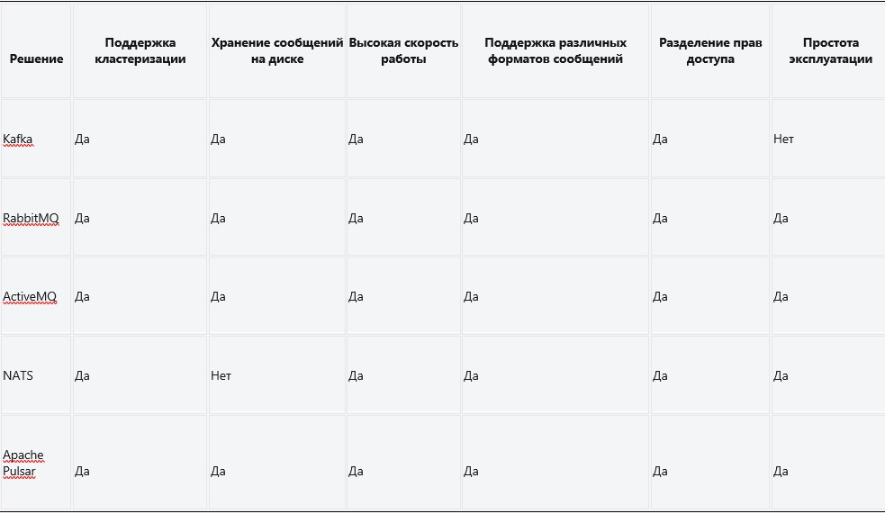

## Задача 1

**Cравнительная таблица возможностей некоторых популярных программных решений для API Gateway:**

Основываясь на этой таблице и требованиях, я рекомендую выбрать Kong в качестве решения для API Gateway.
Обоснование выбора:

1. Маршрутизация запросов: Kong обладает мощными возможностями маршрутизации, которые позволяют настраивать и управлять маршрутами запросов к нужному сервису на основе гибкой конфигурации.
2. Проверка аутентификации: Kong обеспечивает встроенную поддержку проверки аутентификационной информации в запросах, включая поддержку JWT, OAuth и других механизмов аутентификации.
3. Терминация HTTPS: Kong предоставляет возможность легко настроить терминацию HTTPS, обеспечивая безопасное соединение между клиентами и бэкенд-сервисами.

В целом, Kong является надежным и гибким решением для реализации API Gateway, которое полностью соответствует вашим требованиям.

## Задача 2

Ниже приведена таблица с возможностями различных брокеров сообщений, учитывая ваши требования:

Исходя из требований, я рекомендую выбрать Apache Pulsar в качестве решения для брокера сообщений.
1.	Поддержка кластеризации: Apache Pulsar обеспечивает надёжность и отказоустойчивость благодаря встроенной поддержке горизонтального масштабирования и кластеризации брокеров сообщений. Это гарантирует высокую доступность и готовность системы.
2.	Хранение сообщений на диске: Apache Pulsar осуществляет хранение сообщений на диске в процессе доставки, что обеспечивает сохранность сообщений в случаях сбоев и позволяет обработать сообщения после восстановления системы.
3.	Высокая скорость работы: Apache Pulsar разработан для высокой производительности и способен обрабатывать миллионы сообщений в секунду с минимальной задержкой. Это обеспечивает высокую скорость обмена данными между разными компонентами системы.
4.	Поддержка различных форматов сообщений: Apache Pulsar поддерживает различные форматы сообщений, включая JSON, Avro, Protobuf и другие, что позволяет легко обмениваться данными в разных приложениях и системах.
5.	Разделение прав доступа: Apache Pulsar предоставляет гибкую систему разделения прав доступа, позволяющую контролировать доступ к различным потокам сообщений и обеспечивать безопасность данных.
6.	Простота эксплуатации: Apache Pulsar обладает удобным интерфейсом управления, хорошо документирован и имеет активное сообщество, что упрощает развертывание и эксплуатацию брокера сообщений.
В целом, Apache Pulsar соответствует всем ваших требованиям и предоставляет надежное, производительное и легко управляемое решение для брокера сообщений.

