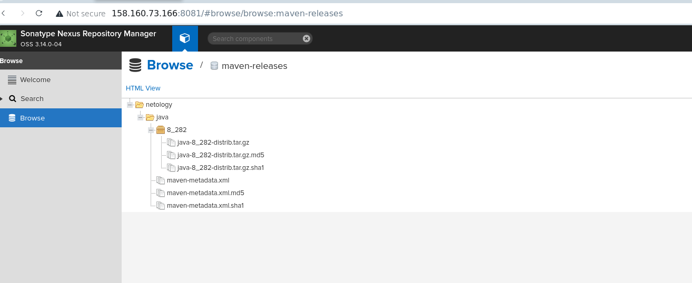

Подготовка к выполнению
Развернул машины, настроил окружение, запустил плейбук.

SonarQube развернул, вошел, сменил пароль.

Nexus

1-4
Создал проект, скачал пакет sjnar-scanner , установил, поменял переменную. Проверил версию(скрин)
Запустил кусок кода из инструкций сонара.

5

Исправил ошибки и запустил заново.

## Nexus

## 1

2/3/4

Maven

